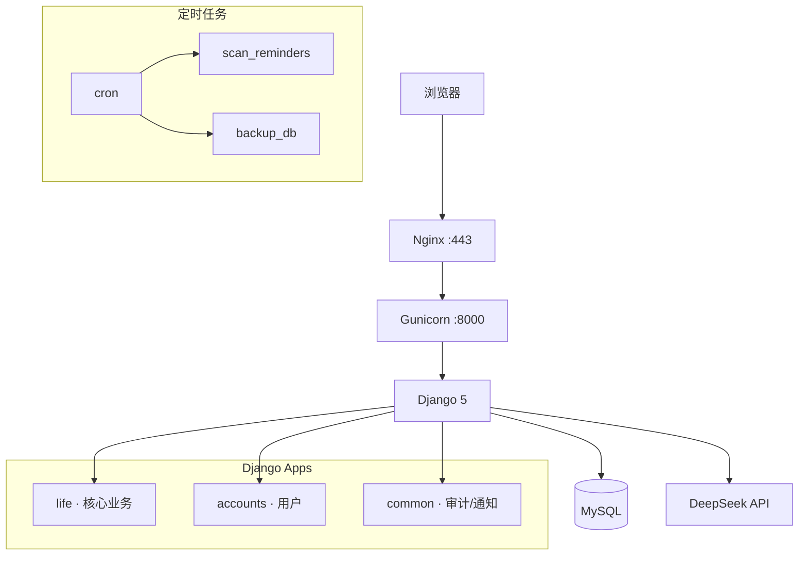
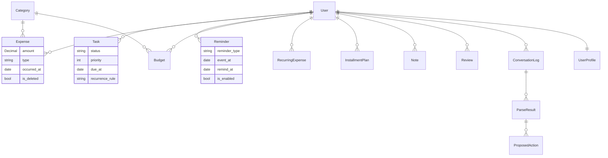
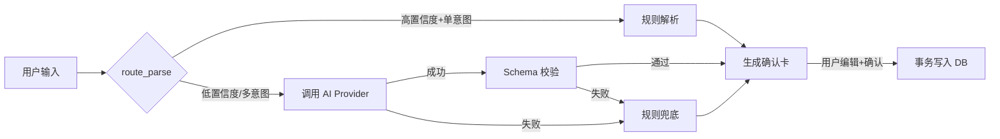

# Personal Life OS

个人生活管理系统 — 语音/文字快速记录消费、待办与想法，AI 辅助解析，确认后保存，数据完全归属你。

## 项目背景

现代人的生活数据分散在多个 App 中：记账软件、待办清单、日历提醒、笔记工具。Personal Life OS 将这一切整合到一个**你自己掌控**的系统中。

**核心理念**：AI 只生成草稿，你来确认。数据存在你自己的服务器上，不经过第三方。

## 核心功能

| 模块 | 功能 |
|------|------|
| 💰 财务管理 | 收支记录、分类、预算、固定支出、分期、月度看板 |
| ✅ 任务管理 | 5 种状态、优先级、重复任务、父子任务 |
| 🔔 提醒 | 生日、账单、纪念日、自定义事件、提前多天提醒 |
| 📝 笔记 | 随心记、周/月复盘草稿 |
| 🤖 AI 解析 | 自然语言输入 → 多意图识别 → 确认卡 → 保存 |
| 📊 看板 | Chart.js 图表、月末预测、异常检测、行动力分析 |
| 📱 PWA | 可添加到手机桌面、离线页面、底部导航 |
| 🔒 安全 | 登录限流、数据隔离、审计日志、威胁模型 |

## 技术栈

| 层 | 技术 |
|----|------|
| 后端 | Python 3.12 + Django 5.2 |
| 数据库 | SQLite (开发) / MySQL (生产) |
| 前端 | Django Templates + Bootstrap 5.3 + Chart.js 4 |
| AI | DeepSeek API (可选，规则优先) |
| 部署 | Gunicorn + Nginx + systemd + Let's Encrypt |
| CI | GitHub Actions (push/PR → test) |

## 架构图



## ER 图（核心模型）



## AI 解析流程



**规则优先**：简单输入如"午饭 18 元"不调用 AI。
**AI 可控**：用户可关闭、设置日上限。
**敏感检测**：输入含身份证/密码/银行卡 → 自动跳过 AI。

## 本地启动

```powershell
git clone https://github.com/zjq3166231393-ui/personal-life-os.git
cd personal-life-os
python -m venv .venv
.\.venv\Scripts\Activate.ps1
pip install -r requirements.txt
Copy-Item .env.example .env
python manage.py migrate
python manage.py runserver
```

打开 <http://127.0.0.1:8000> → 注册 → 开始使用。

## 测试

```powershell
python manage.py test                 # 194 tests
python manage.py check                # 系统检查
python manage.py check --deploy       # 部署检查
python manage.py run_eval             # AI 解析评测
python manage.py verify_db            # 数据库验证
```

## Demo 数据

```powershell
python manage.py seed_demo            # 创建 demo 用户（密码: demo123456）
python manage.py seed_demo --clean    # 清理所有 demo 数据
```

创建完整一个月的虚拟数据：收支、预算、固定支出、分期、任务、提醒、笔记、复盘。

## 隐私设计

| 原则 | 实现 |
|------|------|
| AI 不直接写库 | 所有解析结果需用户确认 |
| 敏感信息不发送 | 身份证/密码/银行卡 → 本地解析 |
| 数据可导出 | JSON/CSV，仅限本人 |
| 数据可删除 | `is_active=False` + 审计记录 |
| 密钥不泄露 | `.env` 仅，git 历史 0 泄露 |

详细说明见 `docs/privacy-and-data.md`。

## 项目结构

```
personal-life-os/
├── config/          Django 配置（settings/urls/wsgi）
├── life/            核心业务（模型/视图/解析/命令）
├── accounts/        用户与权限
├── common/          审计/通知/推送/邮件
├── deploy/          生产部署配置
├── docs/            项目文档（10+ 篇）
├── tests/           评测数据集
├── static/          静态文件 + 离线页面
├── .github/         CI workflow
└── requirements.txt 仅 3 个 pip 包
```

## 已知限制

| 限制 | 说明 |
|------|------|
| 单用户设计 | 个人使用，非 SaaS |
| 无 2FA | 密码 + 限流，无两步验证 |
| SQLite 锁 | 生产建议 MySQL |
| 无 Redis | 限流计数器进程不共享 |
| 无 OAuth | 仅用户名密码注册 |

详见 `docs/v1-release-audit.md`。

## 版本历史

| 版本 | 测试 | 提交 | 核心 |
|------|------|------|------|
| v0.1 | 2 | 1 | 语音原型 |
| v0.2 | 48 | 10 | 账户/CRUD/审计 |
| v0.3 | 105 | 8 | 财务核心 |
| v0.4 | 135 | 6 | 任务/今日页 |
| v0.5 | 183 | 9 | AI 录入 |
| v0.6 | 186 | 7 | PWA/通知 |
| v0.7 | 190 | 8 | 看板/建议 |
| v0.8 | 190 | 7 | 安全/部署 |
| v0.9 | 194 | 12 | 工程质量/打磨 |

## 许可

MIT License — 个人使用，自由修改。
